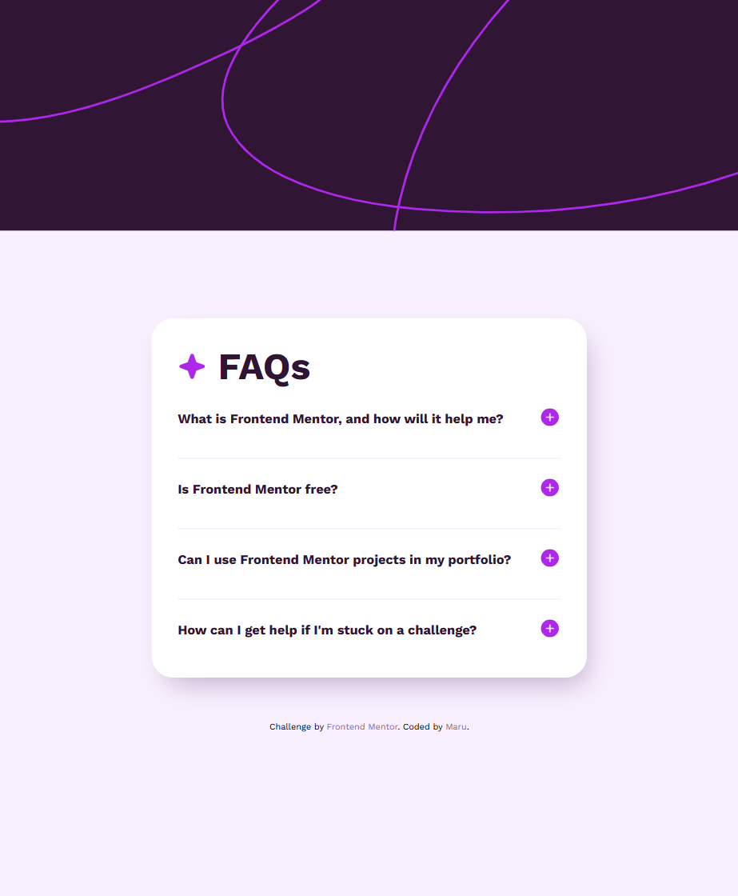
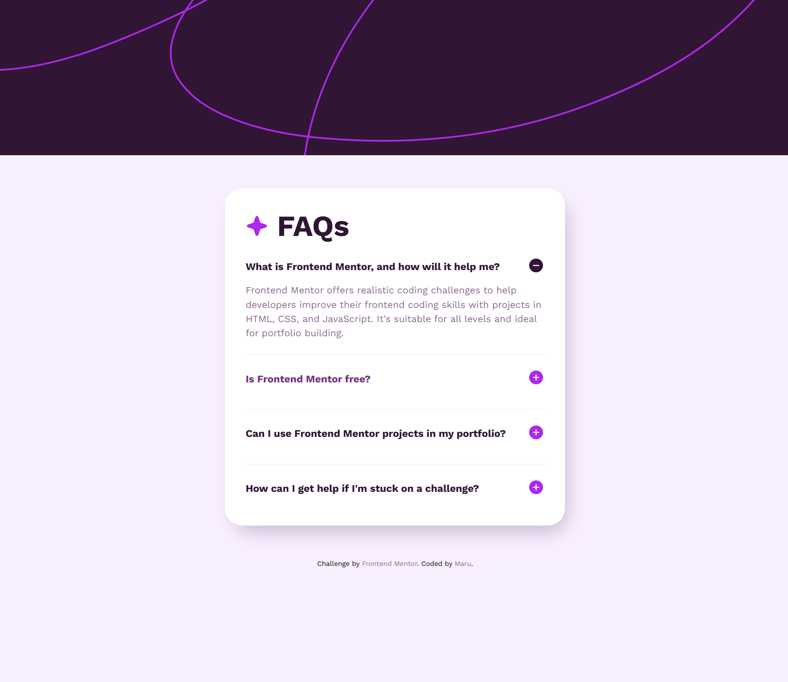
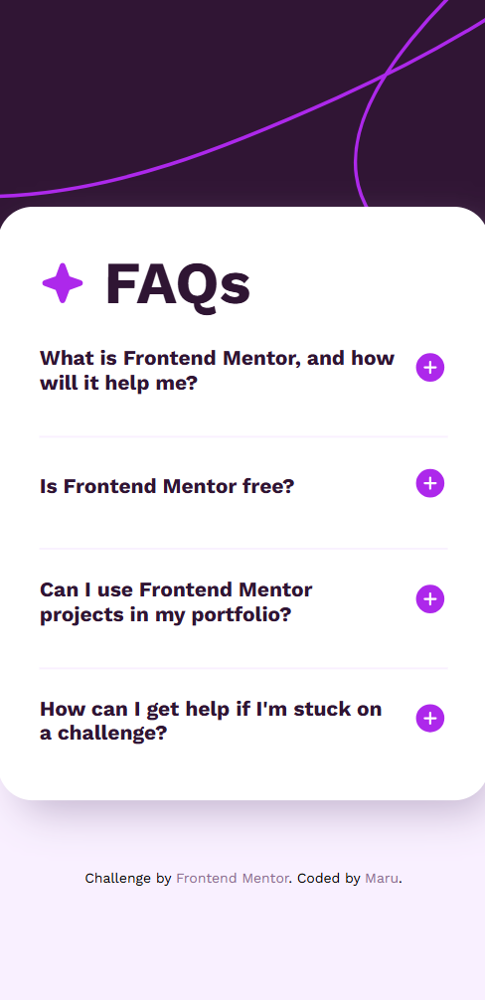

# Frontend Mentor - FAQ accordion


This is a solution to the [FAQ accordion challenge on Frontend Mentor](https://www.frontendmentor.io/challenges/faq-accordion-wyfFdeBwBz). Frontend Mentor challenges help you improve your coding skills by building realistic projects.

## Table of contents

- [Overview](#overview)
  - [The challenge](#the-challenge)
  - [Screenshot](#screenshot)
  - [Links](#links)
- [My process](#my-process)
  - [Built with](#built-with)
  - [What I learned](#what-i-learned)
  - [Continued development](#continued-development)
- [Author](#author)

## Overview

### The challenge

Users should be able to:

- Hide/Show the answer to a question when the question is clicked
- Navigate the questions and hide/show answers using keyboard navigation alone
- View the optimal layout for the interface depending on their device's screen size
- See hover and focus states for all interactive elements on the page

### Screenshot







### Links

- Solution URL: [Add solution URL here](https://www.frontendmentor.io/solutions/faq-accordion-XhzjilwP-u)
- Live Site URL: [Add live site URL here](https://faq-accordion-olive-iota.vercel.app/)

## My process

### Built with

- HTML5 markup
- CSS
- Flexbox
- JavaScript

### What I learned

During this project, I learned how to:

- I learned how to build an accessible accordion UI using the `aria-expanded` attribute to indicate the open/close state of each question.
- I discovered that using `display: none` does not support transitions, so I used a combination of `opacity`, `visibility`, and `max-height` to create smooth open/close animations.
- I practiced controlling background image layout on different screen sizes using `background-size: cover` and `background-position: top center`.
- I improved my use of semantic HTML and BEM-style class naming to make the structure more maintainable and readable.

```JavaScript
const handelClickButton = (e) => {
  const target = e.currentTarget;
  const expanded = target.getAttribute("aria-expanded") === true;
  target.setAttribute("aria-expanded", !expanded);
  target.parentElement.classList.toggle("is-open");
};
```

```CSS
.accordion_answer {
  color: var(--purple-600);
  font-size: 1.4rem;
  padding-top: 1rem;
  line-height: 1.5;

  opacity: 0;
  max-height: 0;
  transition: 0.5s;
  overflow: hidden;
}

.accordion_item .accordion_answer {
  visibility: hidden;
}

.accordion_item.is-open .accordion_answer {
  visibility: visible;
  opacity: 1;
  max-height: 300px;
}
```

### Continued development

- Enhancing the UI/UX with animations
- Toggle between light and dark themes
- Improving responsiveness on various devices and ensuring better visual balance between the background image and the main content are also future goals.

## Author

- Frontend Mentor - [@zerowater](https://www.frontendmentor.io/profile/zerowater4704)
- Twitter - [@jnyngxi188584](https://www.x.com/jnyngxi188584)
